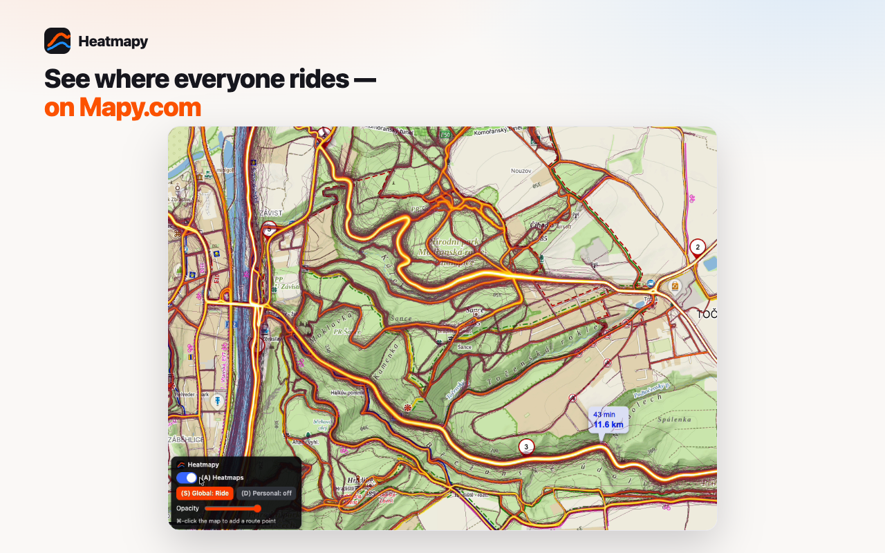
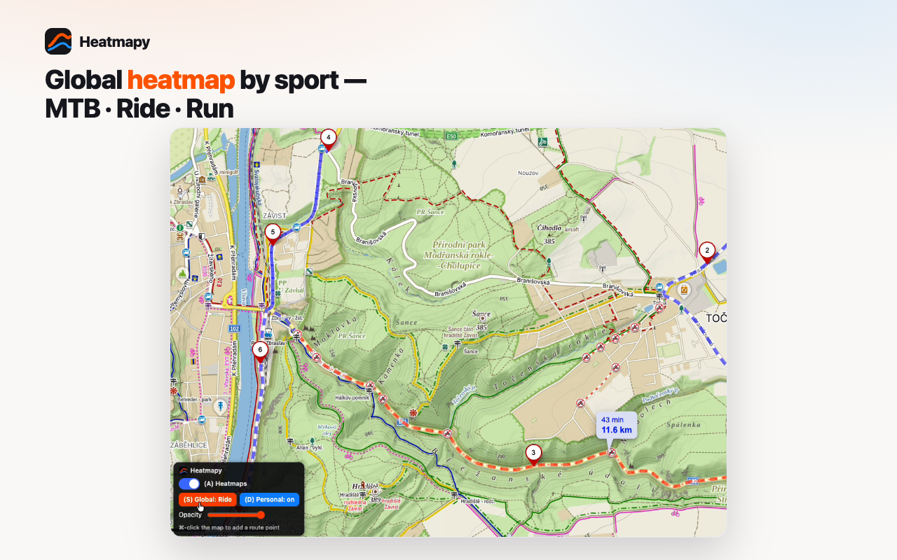
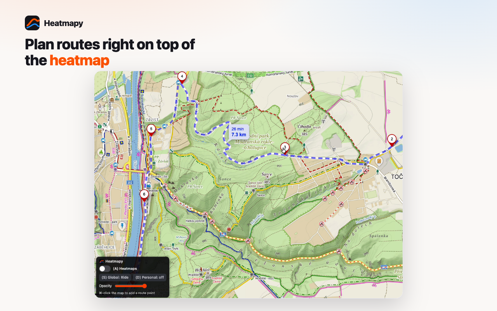
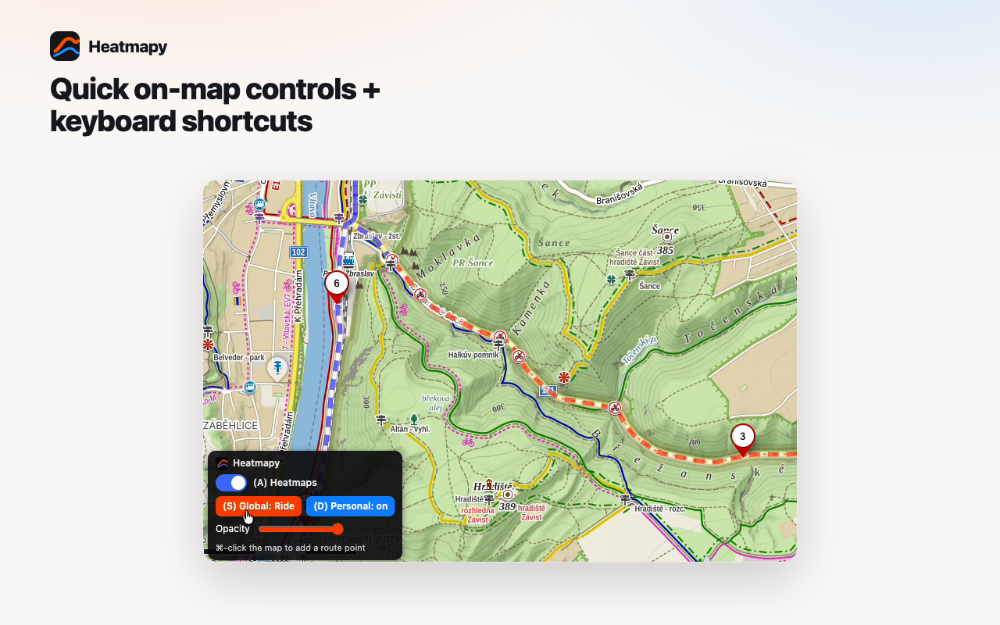

# Heatmapy — Strava Heatmap for Mapy.com

Overlay your **Strava heatmaps** on [Mapy.com](https://mapy.com) — the **global
heatmap split by sport** (MTB / Gravel / Road / Run, in *hot*) plus your own **personal
heatmap** (in blue), shown together over the real map. Find the roads and trails
you've never ridden or run yet — on the map with the best route planning around.

**[🌐 heatmapy.com](https://heatmapy.com)** &nbsp;·&nbsp;
**[🧩 Get it on the Chrome Web Store](https://chromewebstore.google.com/detail/pkifpafiblikmgkcpkbdjmoapjnladok)** &nbsp;·&nbsp;
**[☕ Buy me a coffee](https://donate.stripe.com/5kQ5kD6bo4oV83UcCd5J600)**

## Screenshots

| | |
| --- | --- |
|  |  |
|  |  |

The **global** heat shows where everyone goes; your **personal** heat (blue) shows
where *you've* already been. Together they make the good lines obvious — and the
ones you still haven't explored. That's the whole point of planning. Per-sport
**MTB / Gravel / Road / Run** layers mean it's not just for cyclists. And Mapy.com's
outdoor + aerial maps and route planner beat the usual map apps for this.

You need to be **logged in to Strava** in the same browser. The global heatmap
above zoom 11 and the personal heatmap require a **Strava Subscription**.

---

## Install

### From the Chrome Web Store (recommended)

**[➡️ Install Heatmapy](https://chromewebstore.google.com/detail/pkifpafiblikmgkcpkbdjmoapjnladok)**,
pin it, then open [Mapy.com](https://mapy.com). Make sure you're **logged in to
Strava** in the same browser (open `strava.com` once). Click the extension icon →
it auto-detects your athlete ID (or paste it from your `strava.com/athletes/<id>`
profile URL).

### From source (unpacked, for development)

1. Clone/download this repo.
2. Chrome → `chrome://extensions` → enable **Developer mode** (top right).
3. **Load unpacked** → select the `extension/` folder.
4. Log in to Strava in the same browser, then open [Mapy.com](https://mapy.com).

## Controls

On-map panel (bottom-left):

- **Sport** — pick the discipline: **Road / MTB / Gravel / Run**. Both layers follow it.
- **Global** — independent on/off for the crowd heatmap.
- **Personal** — independent on/off for *your* heatmap.
- **⏻** — master mute: hides everything at once (your per-layer choices are
  remembered) and brings it all back.
- **Opacity** slider — one control for both layers.
- **Send route to Strava** — uploads your planned Mapy route to your Strava
  account as a Route (requires a Strava subscription). From there it syncs to your
  bike computer — see below.
- **⬇** — plain GPX download (no account needed), to import manually.

The global and personal layers toggle **independently**, so you can show your
personal heat on its own, the global heat on its own, both, or neither.

Keyboard: `A` all on/off · `S` cycle sport · `D` global · `F` personal ·
`[` / `]` opacity. When planning a route, **⌘-click (Mac) / Ctrl-click (PC)** the
map to add a point.

## Getting a planned route onto your Garmin / Wahoo

The fast path is **Send route to Strava** (one click), then let your device pull
it from Strava — both brands do this once you've linked them **one time**:

- **Garmin:** connect Strava in Garmin Connect (Strava route sync). New Strava
  routes then auto-appear in **Courses** on your Edge/watch on the next sync.
- **Wahoo:** in the Wahoo app, link your Strava account under route providers.
  Your Strava routes show up in the app and sync to the ELEMNT over Wi-Fi.

(Uploading a GPX as a Strava *route* is a Strava subscriber feature; free accounts
can use the **⬇ GPX download** and import manually instead.)

## How it works

- A **service worker** (`background.js`) fetches Strava heatmap tiles with your
  logged-in cookies (`host_permissions` for `*.strava.com`) — content scripts
  can't do credentialed cross-origin fetches in MV3, the worker can.
- `content.js` renders two stacked tile layers over Mapy's map, caches global
  tiles in IndexedDB (instant on reopen) and everything in memory, and
  canvas-recolors the personal tiles (Strava serves them as opaque black) to a
  transparent blue overlay.
- Endpoints: global `content-a.strava.com/identified/globalheat/sport_*/hot/...`,
  personal `personal-heatmaps-external.strava.com/tiles/<athleteId>/...`.

### MTB vs road: actually split

The web app's `content-*.strava.com/identified/globalheat/sport_<X>/...` endpoint
serves **per-discipline** heat — `sport_Ride` (road) vs `sport_MountainBikeRide` —
which the public `heatmap-external/.../ride/...` tiles do not (those aggregate
every ride sub-type into `ride`). `S` cycles MTB → Ride → Run, and the personal
layer (`D`) follows the same discipline. This needs your logged-in Strava cookies
(and a subscription for z>11); the official Strava API can't help — the heatmap is
an internal tile service outside the public API.

## Privacy

The extension only talks to Strava (to fetch your heatmap tiles, using cookies
already in your browser) and stores small settings locally. It sends nothing to
any third party. See [PRIVACY.md](PRIVACY.md).

## Support

If Heatmapy saves you time on the bike, **[buy me a coffee ☕](https://donate.stripe.com/5kQ5kD6bo4oV83UcCd5J600)**.
Found a bug or have an idea? **[Open a GitHub issue](https://github.com/matejcermak/heatmapy/issues)** —
it's actively maintained.

---

*Independent project — not affiliated with Strava or Mapy.com.*
